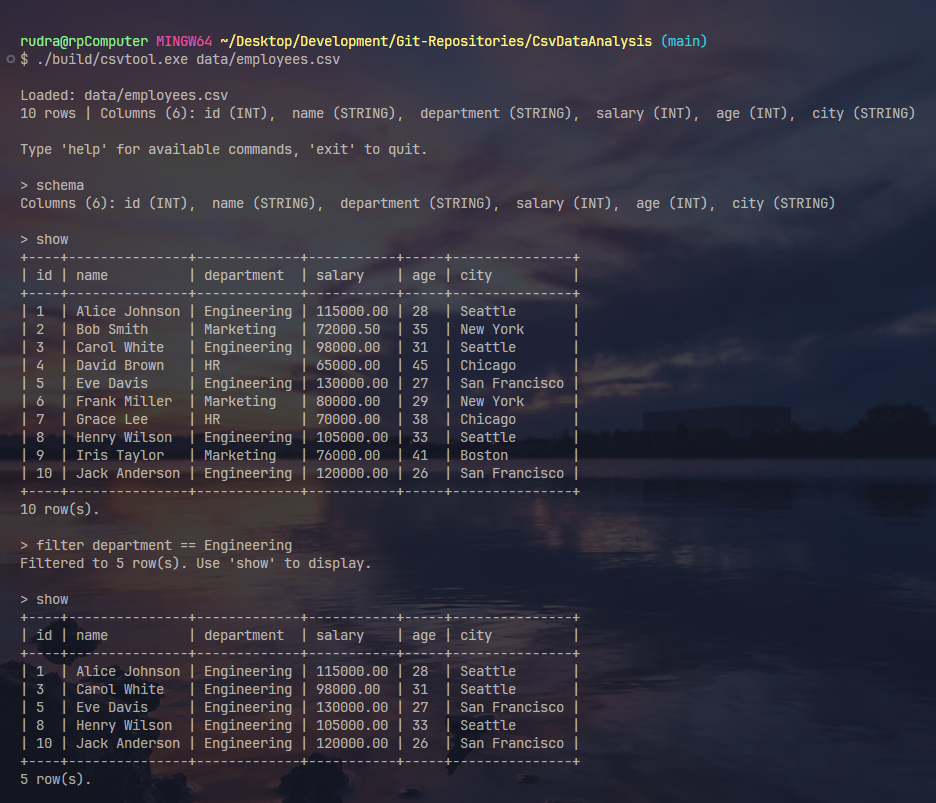
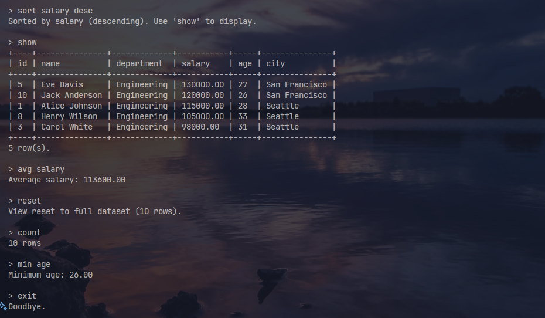

# CSV Data Analysis Tool

A command-line C++ application I built from scratch that lets you load a `.csv` file into memory, inspect its contents, and run queries against the data — all without a database engine or any external libraries.

I built this project to go deep on core C++ concepts: manual memory management, the STL, real parsing logic, and clean separation of concerns across a multi-class architecture.

---

## Demo

**Loading a file and exploring the schema:**



**Filtering, sorting, and computing aggregates:**



---

## Features

- **CSV Parsing** — reads any `.csv` file line by line, correctly handling quoted fields that contain commas (e.g. `"New York, NY"`), Windows `\r\n` line endings, and empty cells
- **Type Inference** — automatically detects whether each column is `INT`, `DOUBLE`, or `STRING` by scanning all values after loading
- **Filter** — filters rows using `==`, `!=`, `<`, `>`, `<=`, `>=`; numeric columns compare as numbers, string columns compare lexicographically
- **Sort** — sorts the current view by any column, ascending or descending, with type-aware comparison
- **Aggregates** — computes `avg`, `sum`, `min`, `max` over any numeric column; `count` reports the number of rows in the current view
- **Interactive REPL** — a persistent session where I can chain filters and sorts incrementally, then `reset` back to the full dataset at any time
- **Aligned table output** — column widths are computed dynamically so the table always fits its data cleanly

---

## Architecture

I divided the project into six classes, each with a single clear responsibility:

| Class | Responsibility |
|---|---|
| `CSVParser` | Opens the file, tokenizes each line into fields |
| `Column` | Stores a column's name, index, and inferred type |
| `Row` | Stores one record as a `map<string, string>` with typed accessors |
| `DataFrame` | Central data structure — holds all rows and columns, exposes the query API |
| `QueryEngine` | Runs the REPL, parses user input, dispatches to `DataFrame` |
| `Printer` | Formats and renders data as an aligned table to `stdout` |

```
main.cpp
   │
   ├── CSVParser        →  vector<vector<string>>
   │
   └── DataFrame
          ├── QueryEngine   (REPL + command dispatch)
          └── Printer       (table rendering)
```

All query methods (`filter`, `sort`) return **new** `DataFrame` objects — the original data is never mutated.

---

## Build & Run

**Requirements:** `g++` with C++17 support, or CMake 3.15+

### With g++ directly
```bash
g++ -std=c++17 -Wall -o build/csvtool.exe \
    src/main.cpp src/CSVParser.cpp src/Row.cpp \
    src/DataFrame.cpp src/Printer.cpp src/QueryEngine.cpp \
    -Isrc
```

### With CMake
```bash
mkdir build && cd build
cmake ..
cmake --build .
```

### Run
```bash
./build/csvtool.exe data/employees.csv
```

---

## Example Session

```
Loaded: data/employees.csv
10 rows | Columns (6): id (INT),  name (STRING),  department (STRING),  salary (DOUBLE),  age (INT),  city (STRING)

Type 'help' for available commands, 'exit' to quit.

> filter department == Engineering
Filtered to 5 row(s). Use 'show' to display.

> sort salary desc
Sorted by salary (descending). Use 'show' to display.

> show
+----+---------------+-------------+-----------+-----+---------------+
| id | name          | department  | salary    | age | city          |
+----+---------------+-------------+-----------+-----+---------------+
| 5  | Eve Davis     | Engineering | 130000.00 | 27  | San Francisco |
| 10 | Jack Anderson | Engineering | 120000.00 | 26  | San Francisco |
...
+----+---------------+-------------+-----------+-----+---------------+

> avg salary
Average salary: 113600.00

> reset
View reset to full dataset (10 rows).

> exit
Goodbye.
```

---

## Available Commands

| Command | Description |
|---|---|
| `show` | Print the current view as a table |
| `schema` | Show column names and inferred types |
| `count` | Print the number of rows in the current view |
| `filter <col> <op> <val>` | Filter rows — supports `==` `!=` `<` `>` `<=` `>=` |
| `sort <col> [asc\|desc]` | Sort the current view by a column |
| `avg <col>` | Average of a numeric column |
| `sum <col>` | Sum of a numeric column |
| `min <col>` | Minimum of a numeric column |
| `max <col>` | Maximum of a numeric column |
| `reset` | Restore the full unfiltered dataset |
| `help` | Print the command reference |
| `exit` | Quit the program |

---

## Concepts I Practiced

- **OOP & encapsulation** — six classes with well-defined interfaces and no exposed internals
- **STL containers** — `std::vector`, `std::map`, `std::sort`, `std::accumulate`, `std::min_element`
- **String parsing** — character-by-character CSV tokenizer handling the RFC 4180 quoting spec
- **RAII & ownership** — clean resource management with no manual `new`/`delete`
- **Const-correctness** — query methods are `const` and return new objects rather than mutating state
- **Error handling** — exceptions with meaningful messages propagate cleanly to the REPL without crashing
- **REPL pattern** — the same read-eval-print loop used in databases, shells, and interpreters
